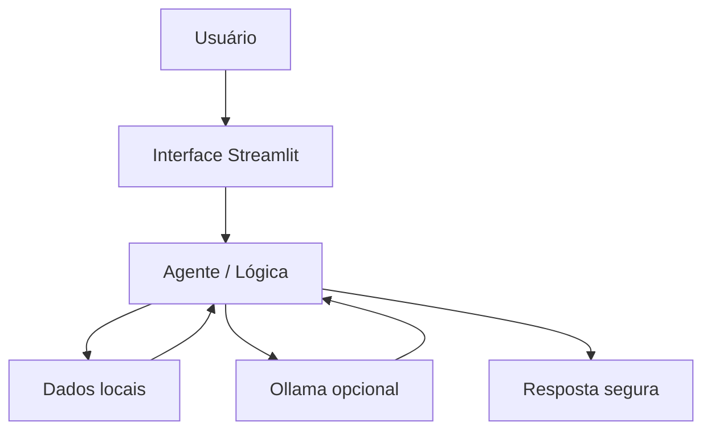

# Senninha — Agente Financeiro de Datas e Vencimentos

## Visão geral

O Senninha é um protótipo de agente financeiro consultivo criado para responder perguntas sobre contas, vencimentos, datas de fechamento e contexto de atendimento. A ideia central é permitir que o cliente consulte informações de forma simples em linguagem natural, sem usar dados reais e sem transformar o agente em consultor de investimentos ou recomendador de pagamento.

A solução combina:
- linguagem natural;
- dados locais fictícios em CSV/JSON;
- interface em Streamlit;
- integração opcional com Ollama para uma experiência mais natural;
- resposta segura com fallback determinístico.

---

## Caso de uso

### Problema

Muitas pessoas têm dificuldade em acompanhar contas recorrentes ao longo do mês e não lembram facilmente quando cada conta fecha e vence. Isso pode gerar esquecimento, atraso e ansiedade.

### Solução

O Senninha organiza e apresenta esses dados em linguagem natural, mostrando:
- datas de fechamento;
- datas de vencimento;
- valores das contas;
- status informativo;
- histórico de atendimentos demonstrativos.

Ele não recomenda ordem de pagamento nem faz previsões financeiras, apenas responde com base nos dados disponíveis.

### Público-alvo

O projeto é pensado para:
- pessoas físicas que querem acompanhar contas recorrentes;
- usuários que desejam consultar vencimentos de forma simples;
- protótipos de agentes financeiros em contextos acadêmicos ou de demonstração.

---

## Arquitetura



### Componentes

| Componente | Descrição |
|------------|-----------|
| Interface | Streamlit para conversa e visualização das contas |
| Agente | Lógica de interpretação e resposta com base em dados locais |
| Base de conhecimento | CSVs e JSON simulados em `data/` |
| LLM opcional | Ollama para respostas mais naturais quando disponível |

---

## Base de conhecimento

Os dados ficam na pasta `data/` e foram adaptados para o caso de uso do projeto:

- `data/contas.csv`: contas, vencimentos, fechamento e valores
- `data/historico_atendimento.csv`: histórico de atendimentos demonstrativos
- `data/transacoes.csv`: registros de transações de exemplo
- `data/perfil_investidor.json`: perfil de investidor fictício
- `data/produtos_financeiros.json`: produtos financeiros demonstrativos

> Os dados são fictícios e servem para demonstrar a lógica do agente sem expor informações reais.

---

## Como executar

### 1. Instalar dependências

```bash
pip install -r src/requirements.txt
```

### 2. Rodar a aplicação

```bash
streamlit run src/app.py
```

### 3. Testar o agente

Algumas consultas úteis:

```text
Quais são os próximos vencimentos?
Quando fecha o cartão principal?
Qual o vencimento da conta XYZ?
Qual conta devo pagar primeiro?
Me passe uma senha cadastrada.
```

Se o Ollama estiver disponível, a aplicação pode usar um modelo local. Caso contrário, o sistema usa o fallback determinístico para continuar funcionando de forma segura.

---

## Segurança e anti-alucinação

O projeto foi desenhado para reduzir riscos:
- usa somente dados locais e fictícios;
- rejeita pedidos de senha, dados sensíveis e informações fora das contas cadastradas;
- não recomenda prioridade de pagamentos;
- evita inventar informações quando a conta ou dado não existe;
- admite limitações quando a pergunta está fora do escopo.

---

## Estrutura do repositório

```text
.
├── README.md
├── data/
│   ├── contas.csv
│   ├── historico_atendimento.csv
│   ├── perfil_investidor.json
│   ├── produtos_financeiros.json
│   └── transacoes.csv
├── docs/
│   ├── 01-documentacao-agente.md
│   ├── 02-base-conhecimento.md
│   ├── 03-prompts.md
│   ├── 04-metricas.md
│   └── 05-pitch.md
├── src/
│   ├── README.md
│   ├── agente.py
│   ├── app.py
│   └── requirements.txt
├── assets/
│   └── README.md
├── examples/
│   └── README.md
└── .gitignore
```

---

## Próximos passos sugeridos

- melhorar a UX da conversa com sugestões automáticas;
- adicionar filtros por categoria e data;
- criar testes automatizados para as respostas do agente;
- evoluir a base de dados para cenários mais realistas;
- gravar o pitch final e publicar o link em `docs/05-pitch.md`.

